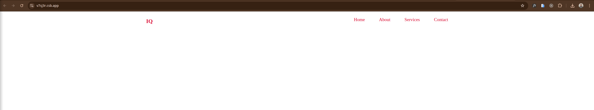
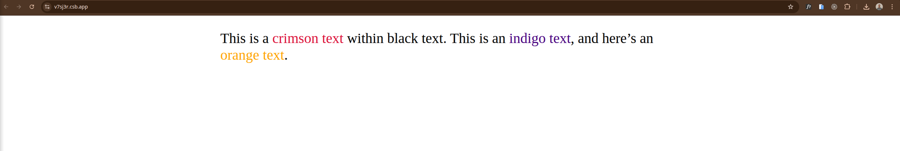

# 📦 Divs & Spans

A clean and friendly guide to understanding **block vs inline elements** and how they help you **group content** in HTML.

---

## 🧱 Block vs. Inline Elements

HTML elements behave differently by default. The two major categories are:

### **Block-level elements (e.g., `<div>`)**

* Take up the **full width** available
* Always start on a **new line**
* Commonly used for large sections or layouts

### **Inline elements (e.g., `<span>`)**

* Only take the **space needed**
* Do **not** start on a new line
* Perfect for styling **part of a sentence**

---

## 🔗 Grouping Content

### Using `<div>` to Group Larger Sections

Use `<div>` when you want to group big chunks of content — like a header, footer, or a section of the page. You can then style or position that whole group using CSS or manipulate it via JavaScript.

**Example:**

```html
<div class="header">
  <h2 class="logo">freeCodeCamp</h2>
  <ul class="nav">
    <li><a href="#">Home</a></li>
    <li><a href="#">About</a></li>
    <li><a href="#">Services</a></li>
    <li><a href="#">Contact</a></li>
  </ul>
</div>
```

**CSS:**

```css
.header {
  padding: 0 70px;
  display: flex;
  justify-content: space-between;
  margin: 20px 0;
  color: crimson;
}
.nav {
  display: flex;
  gap: 60px;
  list-style: none;
}
.nav li a {
  text-decoration: none;
  font-size: 1.2rem;
  color: crimson;
}
```

This shows how a `<div>` can wrap a bunch of elements so you can style or manage them as a single group.


<!--  -->

---

### Using `<span>` to Highlight or Style Small Parts

Use `<span>` when you only need to change the appearance or behavior of part of a line of text (or other inline-content). It’s perfect for small styling hooks or for JavaScript targeting.

**Example:**

```html
<p>
  This is a <span class="crimson">crimson text</span> within black text.
  This is an <span class="indigo">indigo text</span>, and here’s
  an <span class="orange">orange text</span>.
</p>
```

**CSS:**

```css
.crimson { color: crimson; }
.indigo { color: indigo; }
.orange { color: orange; }
p { font-size: 2.5rem; }
```

Here, the `<span>` elements let you style specific words without breaking the flow of the paragraph.


<!--  -->

---

## 📌 Summary

* Use **`<div>`** for grouping **large blocks** or layout sections.
* Use **`<span>`** for **small inline styling** or targeting specific words.

