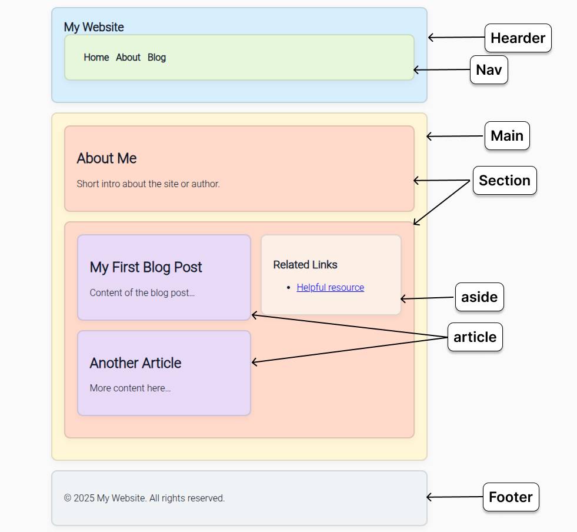

# Semantic HTML: Why It Matters ✨

Semantic HTML is about using the *right* HTML elements to express **meaning**, not just layout. It improves readability for humans, helps search engines index your pages, and makes websites accessible to assistive technologies.

---

## Header, Nav, Main, Section 🧭

**`<header>`**

* Use for the top part of a page or a section — logo, site title, or intro content.
* Helps both users and machines identify the start of content.

**`<nav>`**

* Wraps primary navigation links (menus, breadcrumbs, site maps).
* Important for both keyboard navigation and search bots.

**`<main>`**

* Contains the primary content of the page (the main subject or primary functionality).
* There should normally be **one** `<main>` per page.

**`<section>`**

* Groups thematically-related content and usually has a heading (`<h2>`, `<h3>`, etc.).
* Good for breaking long pages into readable chunks.

---

## Article, Aside, Footer 📝💬🦶

**`<article>`**

* A self-contained piece of content: a blog post, news item, or user-submitted entry.
* If the content could be published or syndicated independently, use `<article>`.

**`<aside>`**

* For related or complementary content: sidebars, related links, or pull-quotes.
* Keeps tangential information separate from the main flow.

**`<footer>`**

* Bottom content for a section or the whole page: metadata, copyright, contact info, legal links.


<!--  -->

---

## Why Semantics Matter (SEO & Accessibility) 🚀♿

### SEO Benefits

* **Better crawling**: Search engines can parse your page structure more reliably.
* **Higher chance of rich results**: Clear structure can improve how your content appears in search (snippets, cards).
* **Clear hierarchy**: Headings + semantic containers tell search engines what's important.

### Accessibility Benefits

* **Screen readers** can quickly identify `nav`, `main`, `header`, `footer`, etc., allowing users to jump to relevant sections.
* **Logical keyboard navigation**: Semantic HTML preserves meaningful tab order and focus behavior.
* **Descriptive images**: Always include `alt` text on images so non-visual users get context.
* **ARIA when needed**: Use ARIA roles/attributes sparingly to supplement semantics (e.g., `aria-live`, `aria-label`).

---

## Handy Semantic Elements List 📚

* `<article>` — standalone content
* `<aside>` — related / sidebar content
* `<figure>` + `<figcaption>` — images/illustrations with captions
* `<details>` + `<summary>` — collapsible content blocks
* `<header>` — intro or navigational header
* `<footer>` — page/section footer
* `<main>` — document's main content
* `<nav>` — navigation links
* `<section>` — thematic groupings
* `<time>` — machine-readable dates/times

---

## Example: A Simple, Semantic Page (Preview in Code)

```html
<!DOCTYPE html>
<html lang="en">
  <head>
    <meta charset="utf-8" />
    <meta name="viewport" content="width=device-width, initial-scale=1" />
    <title>Semantic HTML Example</title>
  </head>
  <body>
    <header>
      <h1>My Website</h1>
      <nav>
        <ul>
          <li><a href="#home">Home</a></li>
          <li><a href="#about">About</a></li>
          <li><a href="#blog">Blog</a></li>
        </ul>
      </nav>
    </header>

    <main>
      <section id="about">
        <h2>About Me</h2>
        <p>Short intro about the site or author.</p>
      </section>

      <section id="blog">
        <article>
          <h2>My First Blog Post</h2>
          <p>Content of the blog post…</p>
        </article>

        <article>
          <h2>Another Article</h2>
          <p>More content here…</p>
        </article>

        <aside>
          <h3>Related Links</h3>
          <ul>
            <li><a href="#">Helpful resource</a></li>
          </ul>
        </aside>
      </section>
    </main>

    <footer>
      <p>© 2025 My Website. All rights reserved.</p>
    </footer>
  </body>
</html>
```

---

## Quick Accessibility Checklist ✅

* Use semantic elements for structure (`header`, `main`, `nav`, `section`, `article`, `aside`, `footer`).
* Ensure one `<main>` per page.
* Provide descriptive `alt` text on images.
* Use meaningful link text (avoid "click here").
* Label form fields with `<label>` and associate via `for` attributes.
* Keep heading order logical (no skipping levels).
* Avoid using semantic elements purely for styling — they should match the content’s meaning.

---

## Conclusion — Keep It Meaningful 🧩

Semantic HTML is a small habit with big returns: better SEO, improved accessibility, and cleaner code. Structure your content with meaning in mind, and both users and machines will thank you.
