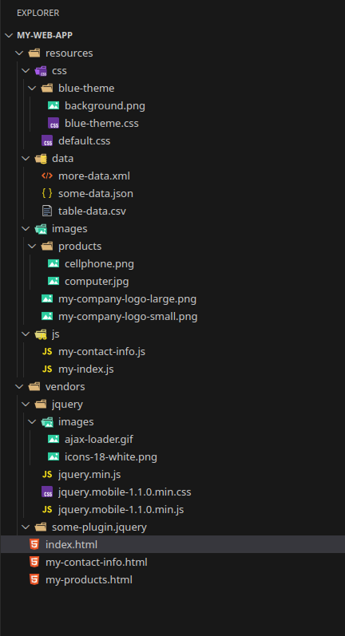

## 📂 File & Folder Organization

When building an HTML/CSS/JS project, it helps a lot to keep files organized so you (and others) can navigate easily and maintain the code.

### Separation of Concerns

* Split your **general-purpose libraries** (e.g., third-party JS/CSS) from your **application-specific code**.
* Use a folder like `vendors` (or `libs`) for reusable or third-party code.
* Use a `resources` (or `src`) folder for your own assets: CSS, JS, images, data, etc.

**Example structure:**

```
my-web-app/
├── resources/
│   ├── css/
│   ├── js/
│   ├── images/
│   └── data/
├── vendors/
└── index.html
```

---

## 🖼️ Assets (images, fonts, media)

Here’s how to handle your static assets cleanly:

1. **CSS Assets**

   * Your main CSS files go in `resources/css/`.
   * If you support themes (like a “blue theme”), create a subfolder:

     ```
     resources/css/
     ├── blue-theme/
     │   ├── blue-theme.css
     │   └── background.png
     └── default.css
     ```

2. **Images Used in Pages**

   * Use `resources/images/` for images that are part of the UI (e.g., logos, product images).
   * Organize by category if needed:

     ```
     resources/images/
     ├── products/
     │   ├── computer.jpg
     │   ├── cellphone.png
     │   └── printer.jpg
     ├── my-company-logo-small.png
     └── my-company-logo-large.png
     ```

3. **Fonts & Other Media**

   * If you have fonts, audio, video, or other media, add more subfolders inside `resources`: e.g., `resources/fonts/`, `resources/media/`.

4. **Data Files**

   * If your application uses JSON, XML, CSV, or other data files, keep them in a `data` folder:

     ```
     resources/data/
     ├── some-data.json
     ├── table-data.csv
     └── more-data.xml
     ```

---

## 🧱 Recommended Project Structure

Putting it all together, here’s a clean, maintainable structure:

```
my-web-app/
├── resources/
│   ├── css/
│   │   ├── default.css
│   │   ├── blue-theme/
│   │   │   ├── blue-theme.css
│   │   │   └── background.png
│   ├── js/
│   │   ├── my-index.js
│   │   └── my-contact-info.js
│   ├── images/
│   │   ├── products/
│   │   │   ├── computer.jpg
│   │   │   └── cellphone.png
│   │   ├── my-company-logo-small.png
│   │   └── my-company-logo-large.png
│   └── data/
│       ├── some-data.json
│       ├── table-data.csv
│       └── more-data.xml
├── vendors/
│   ├── jquery/
│   │   ├── jquery.min.js
│   │   ├── jquery.mobile-1.1.0.min.js
│   │   ├── jquery.mobile-1.1.0.min.css
│   │   └── images/
│   │       ├── ajax-loader.gif
│   │       └── icons-18-white.png
│   └── some-plugin.jquery/
├── index.html
├── my-contact-info.html
└── my-products.html
```

---

## ✅ Naming & Conventions (Best Practices)

* Use **lowercase letters** for all folders and files.
* When using multiple words, **use hyphens** (e.g., `my-company-logo-small.png`).
* Keep your CSS and JS **as generic as possible**, but isolate page-specific code:

  * `my-index.css` & `my-index.js` for the index page
  * `my-contact-info.css` & `my-contact-info.js` for the contact page
* Stick to **one naming convention** throughout — consistency helps others understand your project easily.

---

## 💡 Why This Organization Helps

* Makes it **easy to find files**: you know where your themes, images, JS files, and data are.
* Separates **third-party code** (in `vendors`) from your own code — this keeps your project clean.
* Helps with **scalability**: if you add more themes, data, or pages, there's a clear place to put things.
* Encourages **readability and maintainability**, for both you and collaborators.

---


<!--  -->
