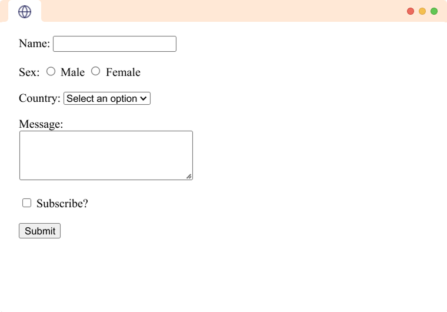

# 📝 Assignment: Forms

The image below shows a `contact` **Form**.

<!--  -->

---

## Instructions

1. Create a folder and open it with **vscode** (your code editor), after create a file `index.html`.
2. Setup the html structure and add the Form elements.
3. Make sure the page title is your full name
4. Preview the webpage in the browser (it should look like the image above).
5. Once you finish, **take a screenshot of your results (vscode and webpage)**.
6. Share your screenshot with your instructor for review.

Happy coding🚀!