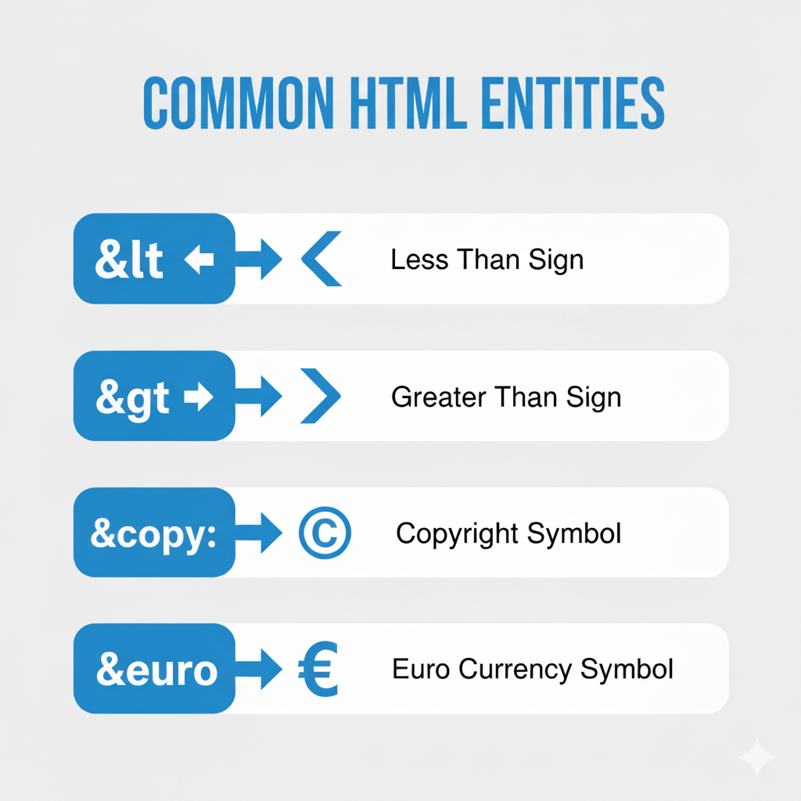

## HTML Entities: Understanding Common Symbols (©, €, `<`, `>`)

### What Are HTML Entities? 🧾

HTML entities are special codes used to display characters that either have a reserved meaning in HTML (like `<` or `&`) or are not easily typed on a keyboard (like © or €). They always begin with `&` and end with `;`.

Using entities ensures your HTML displays correctly, without confusing the browser’s parser.

---

### Why Use HTML Entities?

* To **safely show reserved HTML characters** (e.g., `<` or `>`), so they don’t get interpreted as tags
* To **display special symbols** (like currency signs) that may not be on your keyboard
* To **prevent layout issues**, for example when you want a space to stay put (non-breaking space)

---

### Commonly Used HTML Entities

Here are some of the most frequently used symbols and how to represent them in HTML:

| Symbol | Description        | Named Entity | Numeric Entity |
| ------ | ------------------ | ------------ | -------------- |
|        | Non‑breaking space | `&nbsp;`     | `&#160;`       |
| `<`    | Less-than sign     | `&lt;`       | `&#60;`        |
| `>`    | Greater-than sign  | `&gt;`       | `&#62;`        |
| `&`    | Ampersand          | `&amp;`      | `&#38;`        |
| `©`    | Copyright          | `&copy;`     | `&#169;`       |
| `€`    | Euro               | `&euro;`     | `&#8364;`      |
| `£`    | Pound sterling     | `&pound;`    | `&#163;`       |
| `¥`    | Yen                | `&yen;`      | `&#165;`       |
| `¢`    | Cent               | `&cent;`     | `&#162;`       |

> And many more: arrows (`&rarr;`, `&larr;`), mathematical symbols (`&sum;`), suits (`&hearts;`), etc.


<!--  -->

---

### Reserved Characters in HTML

Some characters are **reserved in HTML** because they have special meanings. To display them safely in your web page, use their entity codes:

* `&` → `&amp;`
* `<` → `&lt;`
* `>` → `&gt;`
* `"` → `&quot;`

---

### Other Special Characters

There are also characters not available on a standard keyboard (or that are tricky to type) — like `≥` or `∃`. You can use either named entities or numeric (decimal or hexadecimal):

* `≥` → `&GreaterEqual;`
* `©` → `&copy;`
* `€` → `&euro;`
* `∃` → `&exist;`

**Code preview:**

```html
<!DOCTYPE html>
<html>
  <head>
    <title>Special Characters Example</title>
  </head>
  <body>
    <p>Greater or equal: &GreaterEqual;</p>
    <p>Copyright: &copy;</p>
    <p>Euro: &euro;</p>
    <p>There exists: &exist;</p>
  </body>
</html>
```

---

### Non‑Breaking Space (`&nbsp;`)

* Use `&nbsp;` to insert a space that **will not break into a new line**.
* Helps preserve extra spaces that browsers might otherwise collapse.
* Example: writing `Hello&nbsp;World` ensures “Hello World” stays on the same line.

---

### Combining Diacritical Marks

Diacritical marks (like accents) can be combined with letters using HTML entities. These allow you to build accented letters that may not exist in your keyboard layout.

| Mark             | How to Combine in HTML | Result |
| ---------------- | ---------------------- | ------ |
| Grave ( ̀ )      | `a&#768;`              | à      |
| Acute ( ́ )      | `a&#769;`              | á      |
| Circumflex ( ̂ ) | `a&#770;`              | â      |
| Tilde ( ̃ )      | `a&#771;`              | ã      |
| ...              | ...                    | ...    |

**Code preview:**

```html
<p>a&#768; → à</p>
<p>a&#769; → á</p>
<p>a&#770; → â</p>
<p>a&#771; → ã</p>
```

---

### Best Practices for Using HTML Entities ✅

* Use **named entities** (like `&lt;`) instead of numeric ones where possible — they’re more readable.
* Always **verify your entity codes** — make sure they render correctly across different browsers.
* Use entities not just for reserved characters, but also for **readability and standard compliance** — especially when dealing with special symbols or international characters.

