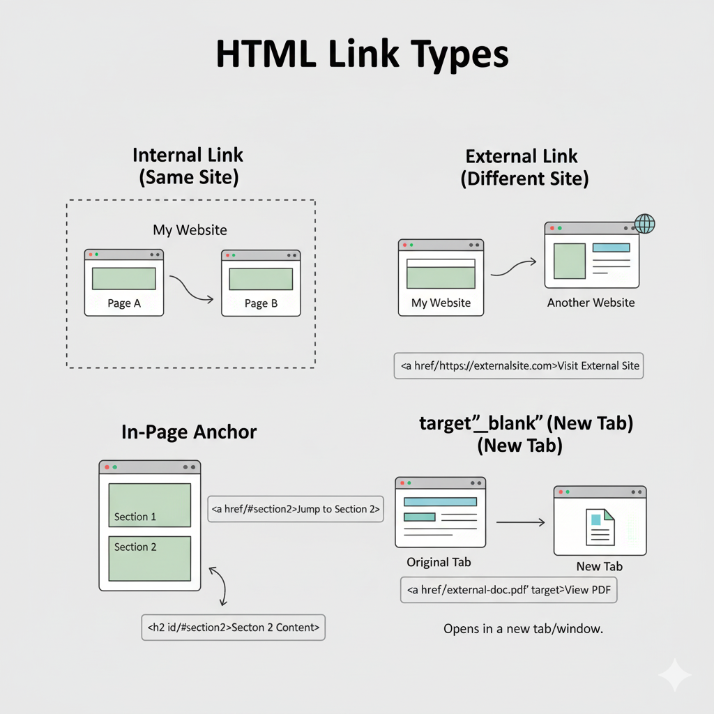

# 🔗 Links & Navigation in HTML

### Anchor Tags: the Building Block
The core of linking in HTML is the `<a>` tag (anchor tag). It’s how you create clickable text or elements that take you somewhere when clicked.

**Basic Syntax**
```html
<a href="https://example.com">Click me</a>
```
- `href` — the URL to navigate to.
- The text between `<a>` and `</a>` is what users click.

---

## Internal Links (🔁)

**What They Are**
Internal links connect pages or sections within your *own* website.

**Using Relative URLs**
```html
<a href="about.html">About Us</a>
```
```html
<a href="../contact.html">Contact</a>
```

**Using Anchor (Fragment) Links**
```html
<!-- Link -->
<a href="#section1">Go to Section 1</a>

<!-- Target -->
<h2 id="section1">Section 1</h2>
```

---

## External Links (🌐)

**What They Are**
External links point to other websites.

**Open in New Tab**
```html
<a href="https://openai.com" target="_blank" rel="noopener noreferrer">
  Visit OpenAI
</a>
```

---

## Anchor Tags (📍 In-Page Navigation)

Use `<a>` with `href="#some-id"` to jump to that part of the page:
```html
<h2 id="features">Features</h2>
<a href="#features">Go to Features</a>
```

---

## Open in New Tab / `target` Attribute (🆕)

**Example**
```html
<a href="page2.html" target="_self">Go to Page 2</a>
<a href="https://other-site.com" target="_blank" rel="noopener noreferrer">External Site</a>
```

---

## Accessibility & Best Practices (♿)

- Use descriptive link text.
- Use `aria-label` for screen readers:
```html
<a href="/pricing" aria-label="See our pricing plans">Pricing</a>
```
- Group navigation links inside a `<nav>` element.

---

## Example: Putting It All Together
```html
<nav>
  <ul>
    <li><a href="index.html">Home</a></li>
    <li><a href="#about">About</a></li>
    <li><a href="https://external.com" target="_blank" rel="noopener noreferrer">External Site</a></li>
  </ul>
</nav>

<h2 id="about">About Us</h2>
<p>Welcome to our site!</p>
```

---

## 📌 When to Use Each Link Type

| Use Case | What to Use |
|---|---|
| Navigate between your own pages | Internal link (relative URL) |
| Jump to a section on the same page | Anchor link (`href="#id"`) |
| Link to an outside website | External link with `target="_blank"` + `rel="noopener noreferrer"` |

---


<!--  -->

