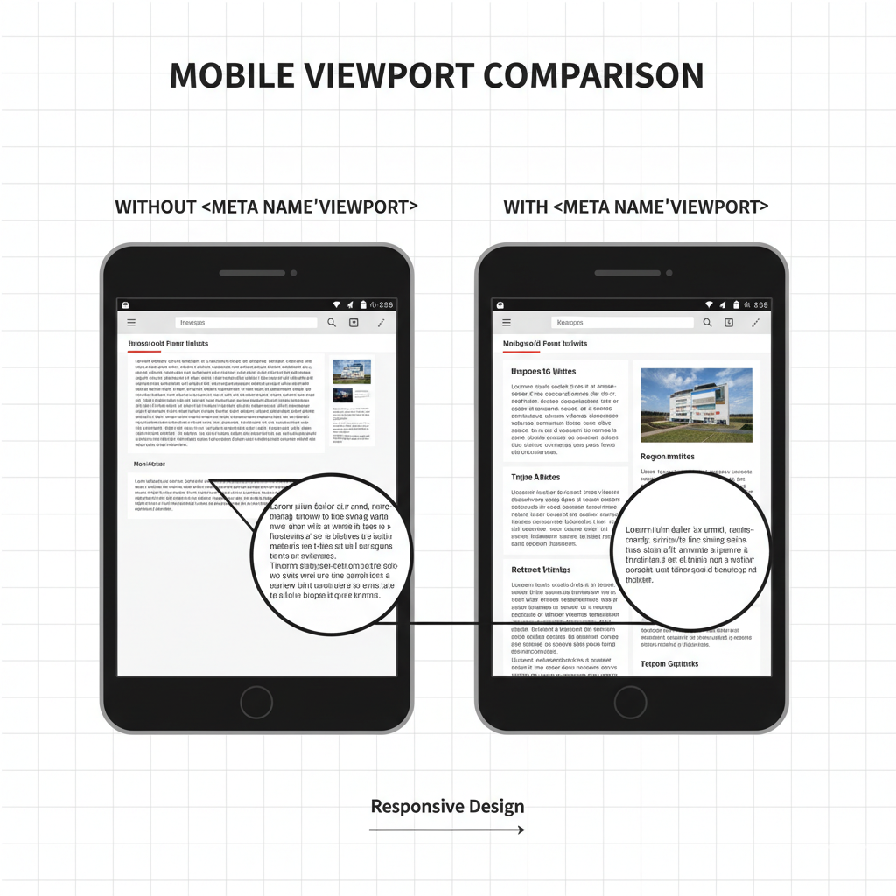
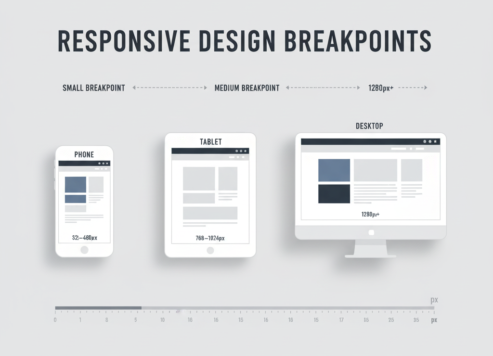

# 📱 Responsive HTML (Without Deep CSS)

## 🌐 Meta Viewport Tag (The Most Important Step)

To make your page behave correctly on mobile, include this inside `<head>`:

```html
<meta name="viewport" content="width=device-width, initial-scale=1">
```

### Why it matters

* Without it, mobile browsers zoom out and shrink your page.
* With it, the layout matches the device width naturally.
* This is the foundation of all responsive behavior—even if you use no CSS.


<!-- /image/meta-viewport.png "Optional title") -->

---

## 🖼️ Fluid Images (Without CSS)

HTML naturally allows images to scale if you avoid hard-coded widths.

### ❌ Do *not* do this:

```html

```

This makes your image *fixed size* and breaks responsiveness.

### ✔ Do this instead:

```html

```

This simple inline style keeps your image responsive without writing a full CSS file.

---

## 📱 Mobile-Friendly HTML Structure

HTML is naturally flexible:

* Text wraps automatically
* Elements stack vertically
* Content adjusts to screen width

To keep things responsive, follow these HTML rules:

### ✔ Use natural flow elements

Use semantic tags like:

* `<header>`
* `<main>`
* `<section>`
* `<footer>`
* `<article>`
* `<nav>`

These naturally stack and adapt to screen size.

### ✔ Avoid tables for layout

Tables do not collapse well on small screens.

### ✔ Avoid fixed widths

```html
<div style="width: 800px;">This breaks mobile layout</div>
```

---

## 📏 Understanding Breakpoints (Concept Only — No Deep CSS)

A **breakpoint** is a screen width where your layout changes.

Even though we are avoiding CSS here, you should *understand* them:

* Phones: **320–480px**
* Tablets: **768–1024px**
* Laptops/desktops: **1280px+**

Breakpoints help you plan how your HTML will behave as screens get larger or smaller.


<!-- /image/breakpoints.png "Optional title") -->

---

## ⭐ Why Responsiveness Matters

* Ensures the site works well on all devices
* Improves accessibility (readable text, no side scrolling)
* Better SEO (Google prioritizes mobile-friendly sites)
* Makes your website feel modern and professional

---

## 🎁 Final Notes (HTML-First Approach)

You can make a **surprisingly responsive site with just HTML** if you:

1. Add the **meta viewport tag**
2. Allow **images to scale**
3. Let **HTML’s natural flow** handle layout
4. Avoid **fixed widths**
5. Understand **breakpoint basics**


