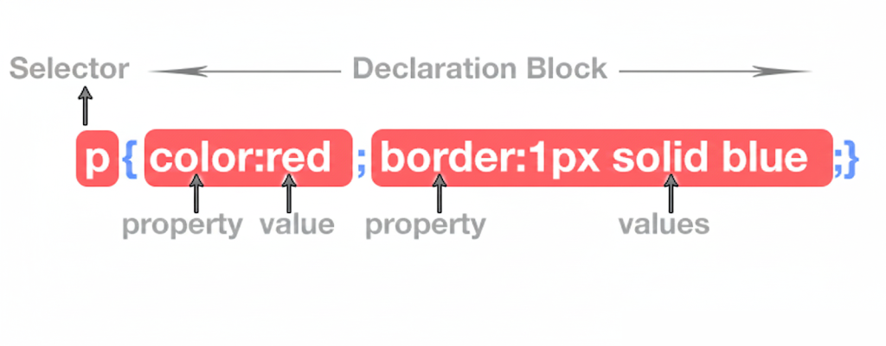
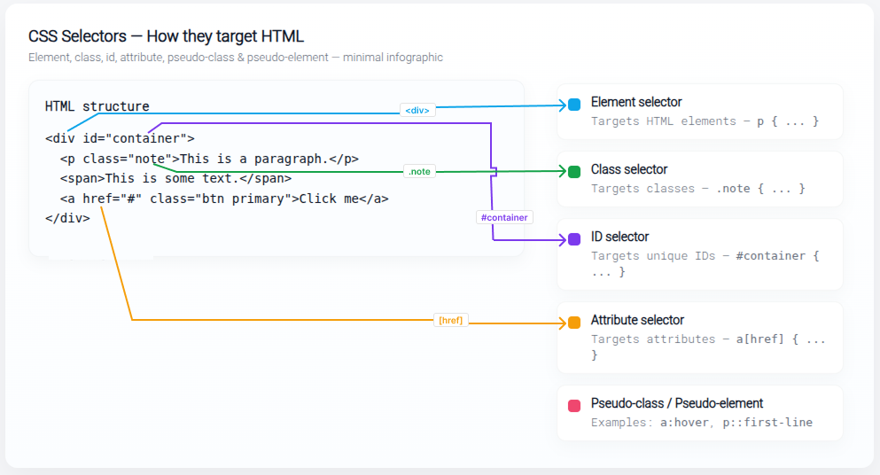

# 🎯 CSS Syntax & Structure

CSS (Cascading Style Sheets) controls the visual presentation of HTML. At its heart a CSS rule looks like this:

```css
selector {
  property: value;
  /* more declarations… */
}
```

* **Selector** — targets which HTML elements to style
* **Declaration block** — the `{ … }` part holding one or more `property: value;` pairs
* **Property** — the style attribute (e.g., `color`, `border`)
* **Value** — the setting for that property (e.g., `red`, `1px solid blue`)


<!--  -->

---

## 🔍 Selectors

Selectors are patterns used to target HTML elements for styling. Think of them as filters that let you pick the elements you want to style.

### Main selector types

* **Element selector** — selects by tag name

```css
h1 {
  font-size: 24px;
}
```

* **Class selector** — selects by class

```css
.button {
  background-color: blue;
}
```

* **ID selector** — selects by id

```css
#main-header {
  border: 1px solid red;
}
```

* **Attribute selector** — selects by attribute

```css
[type="text"] {
  border: 1px solid green;
}
```

* **Pseudo-class** — selects based on state (e.g., `:hover`)

```css
a:hover {
  color: red;
}
```

* **Pseudo-element** — selects a part of an element (e.g., `::first-letter`)

```css
p::first-letter {
  font-size: 2em;
}
```


<!--  -->

---

## ➕ Combining selectors

Use combinations to precisely target elements based on structure or relationship.

* **Descendant selector** — selects nested elements

```css
div p {
  color: green;
}
```

* **Child selector** — selects direct children

```css
ul > li {
  list-style-type: square;
}
```

* **Group selector** — apply same styles to multiple selectors

```css
h1, h2, h3 {
  color: navy;
}
```

* **Adjacent sibling selector** — an element that directly follows another

```css
h1 + p {
  margin-top: 10px;
}
```

---

## 📊 Specificity — why some styles win

When multiple rules target the same element, **specificity** decides which rule applies.

Order of precedence (highest → lowest):

1. Inline styles (e.g., `style=""`) — highest
2. ID selectors (`#id`)
3. Class selectors, attribute selectors, and pseudo-classes (`.class`, `[attr]`, `:hover`)
4. Element selectors and pseudo-elements (`div`, `p`, `::first-letter`) — lowest

**Example:**

```css
p { color: red; }
.special { color: green; }
#unique { color: blue; }
```

```html
<p id="unique" class="special">Hello</p>
```

The paragraph is **blue** because `#unique` has the highest specificity.

---

## 🛠 Properties

Properties are the style attributes you set. A few frequently used ones:

```css
div {
  color: black;           /* text color */
  font-size: 16px;        /* text size */
  margin: 10px;           /* space around the element */
  background-color: #f5f5f5;
  border: 1px solid #ccc;
}
```

Group related properties (layout, typography, colors) to keep code readable.

---

## ✅ Values

Values are the actual settings you give properties. They come in many forms:

* **Keywords:** `auto`, `none`, `block`, `inline`
* **Length units:** `px`, `em`, `rem`, `vh`, `vw`
* **Colors:** named colors `red`, hex `#ff0000`, `rgb()` or `hsl()`
* **URLs:** `background-image: url("image.png")`

**Examples:**

```css
p { font-size: 1rem; }
.container { width: 80%; }
h1 { color: #1a73e8; }
```

---

## 💬 Comments

Use comments to document, explain, and separate sections of CSS. They are ignored by browsers.

```css
/* Header styles */
header { padding: 20px; }

/* Utility class used across components */
.u-hidden { display: none; }
```

Good comments help future you (and teammates) understand why specific choices were made.

---

## 💡 Best Practices

* Prefer **classes** for styling — they’re reusable and predictable.
* Avoid over-specific selectors; keep them simple and maintainable.
* Use **IDs** sparingly because they increase specificity and make overrides harder.
* Organize styles with comments and clear grouping (layout, typography, colors).
* Adopt a naming convention (e.g., BEM) for clarity in larger projects.
* Consider preprocessors (Sass/LESS) or CSS-in-JS for modularity and reuse.


