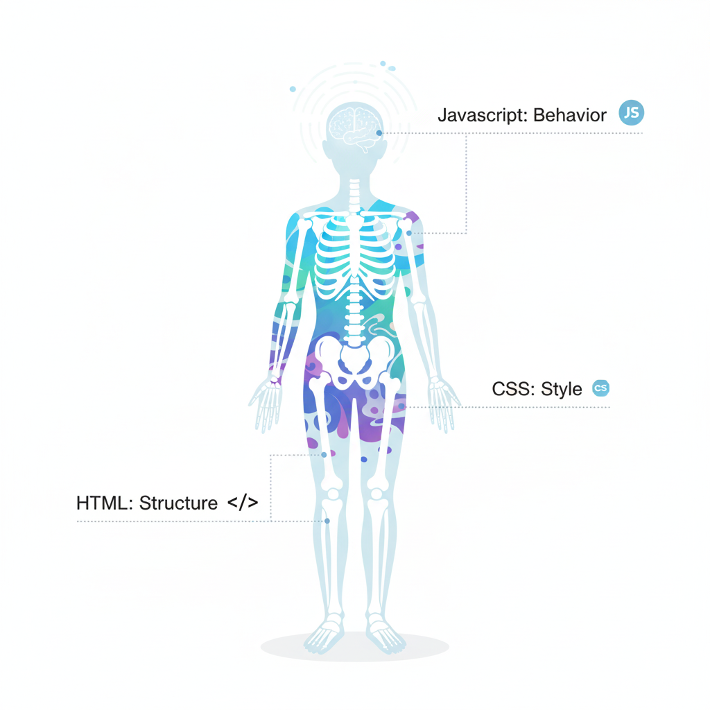
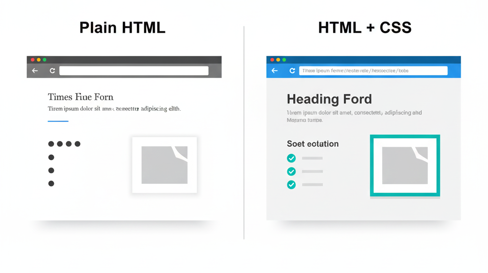
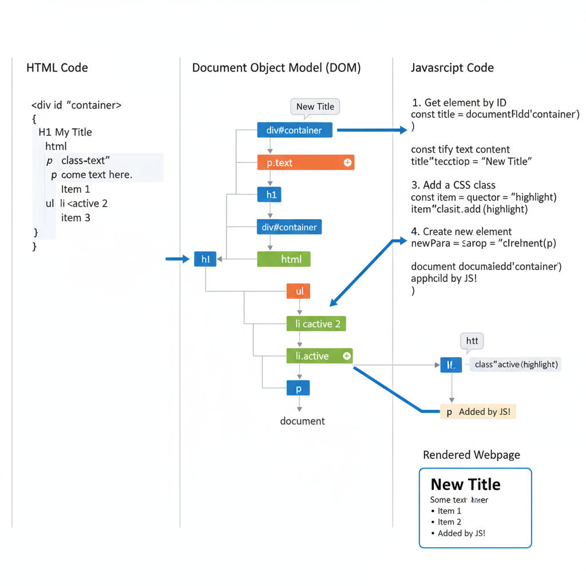

# 🌐 Understanding HTML

A clear and well-organized guide to understanding how **HTML**, **CSS**,
and **JavaScript** work together in modern web development.

---

## 🔤 What HTML Stands For

**HTML** means **HyperText Markup Language**.  
It isn’t a programming language — it's a **markup** language used to
structure content on the web.

Think of HTML as the **skeleton of a webpage**, defining:

- Headings  
- Paragraphs  
- Images  
- Lists  
- Links  
- Forms  
- Layout structure  


<!--  -->

---

## 🎨 How HTML Fits with CSS and JavaScript

Modern web development depends on three core technologies:

### 🧱 **HTML → Structure**
Defines what appears on the page.

### 🎀 **CSS → Presentation**
Controls layout, fonts, colors, spacing, positioning, and responsiveness.


<!--  -->

### ⚙️ **JavaScript → Behavior**
Adds interactivity, animations, dynamic updates, API calls, and logic.


<!--  -->

Together, they form the foundation of the web:


---

## 🏗️ The Role of HTML in Web Development

HTML is responsible for:

### 1️⃣ **Structuring Content**
Every webpage starts with HTML.  
It defines the meaning and hierarchy of elements.

### 2️⃣ **Providing Semantics**
Tags like `<header>`, `<main>`, `<footer>`, `<article>`, and `<nav>`
help browsers and search engines understand the purpose of content.

### 3️⃣ **Acting as the Base Layer**
- CSS **styles** HTML elements.  
- JavaScript **interacts with or changes** HTML elements.  
- Frameworks (React, Vue, Svelte) eventually **produce HTML**.

### 4️⃣ **Remaining Universal**
HTML is supported by every browser — mobile, desktop, or embedded.

---

## 🧩 Example: HTML, CSS, and JavaScript Working Together

Below is a simple combined example showing structure, style, and behavior:

```html
<!-- HTML: Structure -->
<h3>Boot.dev is the best computer science education site</h3>
<p>And if you disagree, try out our courses and be convinced!</p>

<style>
  /* CSS: Styles */
  body {
    background-color: lightgrey;
    color: blue;
  }

  h3 {
    background-color: black;
    color: white;
  }
</style>

<script>
  // JavaScript: Behavior
  document.querySelector('h3').addEventListener('click', () => {
    alert("You clicked the headline! 🚀");
  });
</script>
```

This example shows the roles clearly:
```
  Layer        Purpose
  ------------ ---------------------------------
  HTML         Creates the heading + paragraph
  CSS          Adds colors + layout
  JavaScript   Adds a click interaction
```

---

## **Summary**
HTML is the foundation of every webpage.
It gives structure and meaning to content, enabling browsers, developers,
and search engines to understand and organize information.
By pairing HTML with CSS for styling and JavaScript for behavior, you can create rich, interactive, and visually appealing web experiences.

Mastering HTML is the first and most essential step toward becoming a confident web developer.