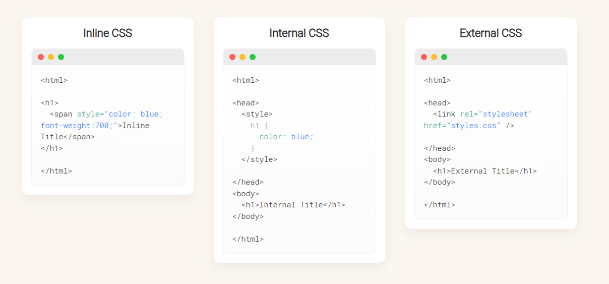

# Ways to Add CSS — Inline, Internal & External

A friendly, easy-to-read guide showing the three main ways to add CSS to your HTML: **Inline styles**, **Internal stylesheet**, and **External stylesheet**. Icons, code previews, and an image prompt are included to make the concepts clear.

---

## 🖌️ Inline Styles

**What it is**: Styles applied directly on an HTML element using the `style` attribute.

```html
<!DOCTYPE html>
<html>
  <body style="background-color: black;">
    <h1 style="color: white; padding: 30px;">Hostinger Tutorials</h1>
    <p style="color: white;">Something useful here.</p>
  </body>
</html>
```

**Advantages**

* ✅ Quick to test or preview changes
* ✅ No need to create a separate CSS file

**Disadvantages**

* ❗ Repetitive — you must style each element individually
* ❗ Makes HTML messy and harder to maintain
* ❗ Can bloat page size and slow down loading

---

## 📄 Internal Stylesheet

**What it is**: CSS placed inside a `<style>` tag in the `<head>` of the HTML document.

```html
<!DOCTYPE html>
<html>
  <head>
    <style>
      body {
        background-color: blue;
      }
      h1 {
        color: red;
        padding: 60px;
      }
    </style>
  </head>
  <body>
    <h1>Hostinger Tutorials</h1>
    <p>This is our paragraph.</p>
  </body>
</html>
```

**Advantages**

* Can use selectors like classes (`.my-class`) and IDs (`#my-id`)
* All styles live in the same file — convenient for single-page styling

**Disadvantages**

* Increases HTML file size, potentially slowing load speed
* Not ideal for multi-page sites — you'd have to copy the same styles to each page

---

## 🌐 External Stylesheet (Best Practice)

**What it is**: A separate `.css` file that your HTML links to using `<link>` in the `<head>`.

**Example `style.css`**

```css
.xleftcol {
  float: left;
  width: 33%;
  background: #809900;
}
.xmiddlecol {
  float: left;
  width: 34%;
  background: #eff2df;
}
```

**Linking from HTML**

```html
<link rel="stylesheet" type="text/css" href="style.css" />
```

**Advantages**

* ✅ Cleaner HTML — styles are separate
* ✅ One stylesheet can be shared across many pages (easy maintenance)

**Disadvantages**

* ❗ Pages may wait to render correctly until the CSS file loads
* ❗ If you include many external CSS files, load time may increase

---

## ✅ Which Method to Use and When

* **Inline CSS** — use for quick testing or tiny, one-off tweaks.
* **Internal CSS** — use when styling a single page where bundling everything in one file is desired.
* **External CSS** — the go-to for multi-page websites and maintainable projects.

---

## 📊 Comparison Table

| Method   | Where It Lives        | When to Use It                      | Pros                           | Cons                          |
| -------- | --------------------- | ----------------------------------- | ------------------------------ | ----------------------------- |
| Inline   | `style` attribute     | Quick tests, single-element tweaks  | Fast, simple                   | Repetitive, messy HTML        |
| Internal | `<style>` in `<head>` | Single-page styling                 | Uses selectors, self-contained | Larger HTML file              |
| External | Separate `.css` file  | Site-wide styling across many pages | Clean, reusable                | Extra HTTP request; dependent |


<!--  -->

---

## Final Thoughts

External stylesheets are generally best for maintainability and scalability. Inline and internal CSS still have valid uses for quick testing, prototyping, and single-page situations. Understanding all three helps you choose the right tool for the job.
