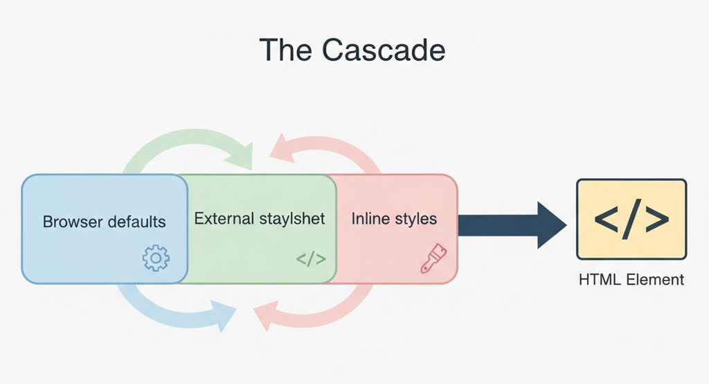
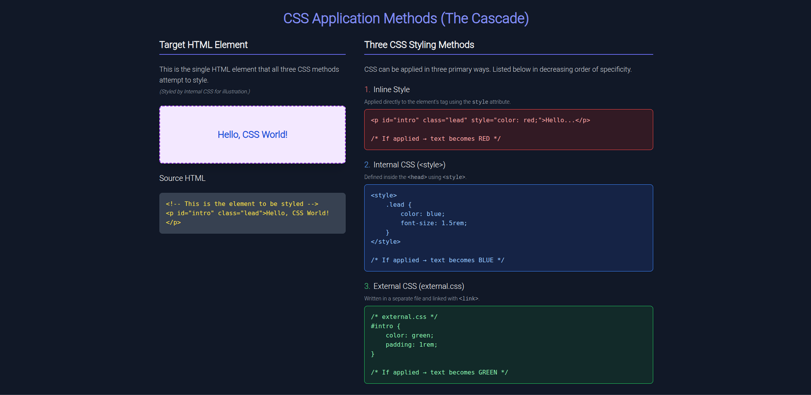

# What Is CSS? ✨

**CSS** stands for *Cascading Style Sheets*. It’s the stylesheet language that tells browsers how to display HTML content — controlling layout, colors, typography, spacing, and visual effects. This document focuses on three simple areas: the meaning of CSS, how it works with HTML, and its role in modern web development.

---

## Meaning of Cascading Style Sheets 🧾

* **Style Sheets** — CSS contains rules that describe how elements should appear on screen (or when printed).
* **Cascading** — multiple rules can apply to the same element. The browser uses the cascade (priority rules) to decide which rule wins.
* **Separation of concerns** — HTML provides the structure and content; CSS provides the presentation. This separation makes sites easier to maintain and evolve.


<!--  -->

---

## How CSS works with HTML 🧩

### Selectors, Properties, and Values

* **Selector**: picks which HTML element(s) to style. Examples: `h1`, `.button`, `#nav`.
* **Property**: the aspect you want to change (e.g., `color`, `margin`, `font-size`).
* **Value**: the setting for that property (e.g., `red`, `20px`).

**Basic example:**

```css
/* This CSS targets all paragraph elements and styles them */
p {
  color: blue;
  font-size: 16px;
  line-height: 1.5;
}
```

### Ways to include CSS in a page

* **External stylesheet** — store CSS in a separate `.css` file and link it from HTML. (Best for maintainability.)

```html
<link rel="stylesheet" href="styles.css">
```

* **Internal stylesheet** — place CSS inside a `<style>` block in the document `<head>`.

```html
<style>
  /* CSS here */
</style>
```

* **Inline styles** — apply styles directly on an element with the `style` attribute. (Generally avoid unless necessary.)

```html
<p style="color: red;">This paragraph is red.</p>
```

### The cascade, specificity, and source order

When multiple rules target the same element, the browser decides the final styles using:

* **Importance** (e.g., `!important` rules)
* **Specificity** (IDs > classes > elements)
* **Source order** (later rules override earlier ones when specificity ties)


<!--  -->

---

## The role of CSS in modern web development 🌐

* **Layout and structure**: CSS lets you build modern layouts using Flexbox and Grid instead of relying on hacks. It controls how content flows and adapts.
* **Responsive design**: With media queries, CSS enables designs that adapt to different screen sizes and devices.

```css
/* Example media query: change font-size on small screens */
@media (max-width: 600px) {
  body {
    font-size: 14px;
  }
}
```

* **Maintainability**: External stylesheets, component-based CSS, and variables help keep styling organized and reusable.
* **Reusability**: CSS custom properties (variables) let you define values once and reuse them.

```css
:root {
  --brand-color: #1a73e8;
}
.btn {
  background: var(--brand-color);
}
```

* **Interactivity and small effects**: Pseudo-classes (`:hover`, `:focus`) and transitions provide lightweight interactivity without JavaScript.

```css
.button:hover {
  transform: translateY(-2px);
  transition: transform 150ms ease;
}
```

* **Performance**: Organize and minify styles, remove unused CSS, and split styles for large apps to keep pages fast.

---

## Quick Reference (Icons + Short Notes)

* 📘 **What** — CSS = Cascading Style Sheets: defines presentation.
* 🔗 **How** — Works by targeting HTML elements with selectors and applying declarations.
* 📱 **Why** — Enables responsive, maintainable, and reusable designs for modern web apps.

---

## Where visuals or code previews help most

* **Diagram of the cascade** — (image prompt above)
* **Side-by-side example** — show an HTML snippet and the external, internal, and inline CSS that affect it. (This helps learners see the cascade in action.)


<!--  -->

