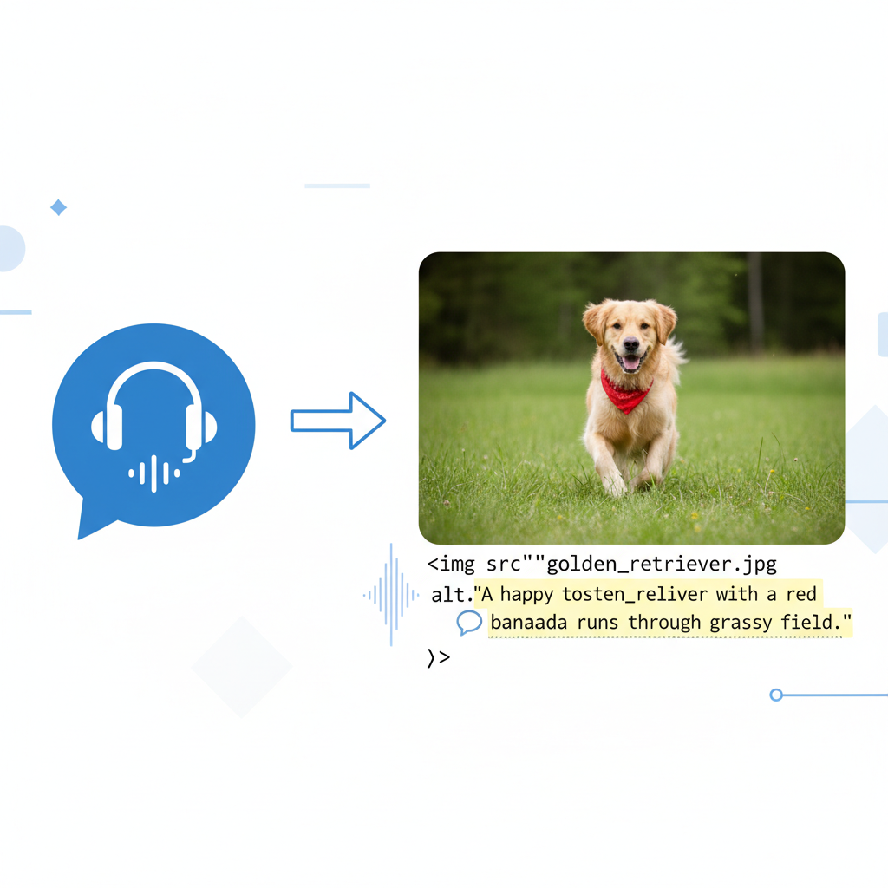

# ✨ Writing Clean, Professional HTML

When writing HTML, it's not just about making things work — it's about making your code clean, readable, and accessible. Below are the key best practices, adapted and reorganized based on your requested headings.

---

## 🧰 Semantic Structure

Using meaningful HTML5 elements (like `<header>`, `<nav>`, `<main>`, `<footer>`, `<article>`, and `<section>`) helps search engines, screen readers, and developers understand your layout.

```html
<header>
  <h1>Site Title</h1>
  <nav>
    <ul>
      <li><a href="/">Home</a></li>
      <li><a href="/about">About</a></li>
    </ul>
  </nav>
</header>

<main>
  <article>
    <h2>Welcome</h2>
    <p>This is my article...</p>
  </article>
</main>

<footer>
  <p>© 2025 My Website</p>
</footer>
```

---

## 🔧 Indentation

Proper indentation shows the hierarchy of your HTML. It makes your code clean and professional. Using a formatter like [**Prettier**](https://marketplace.visualstudio.com/items?itemName=esbenp.prettier-vscode) can automatically keep your HTML consistently indented and clean.

```html
<!-- Bad indentation -->
<ul>
<li>Item 1</li><li>Item 2
<ul><li>Subitem A</li></ul></li>
</ul>

<!-- Clean indentation -->
<ul>
  <li>Item 1</li>
  <li>Item 2
    <ul>
      <li>Subitem A</li>
    </ul>
  </li>
</ul>
```


<!--  -->

---

## 📖 Readability

Readable HTML is easier to maintain.

* Use **lowercase** tags and attributes.
* Use clear **class** and **id** names.
* Group related elements logically.
* Avoid overly long lines.

Example:

```html
<div class="product-card">
  <h2 class="product-title">Laptop</h2>
  <p class="product-price">$899</p>
</div>
```

---

## 💬 Comments

Comments help explain sections of your code.

```html
<!-- Navigation Bar -->
<nav class="main-nav">
  <ul>
    <li><a href="/">Home</a></li>
    <li><a href="/services">Services</a></li>
  </ul>
</nav>
```

Use comments to:

* Mark sections
* Explain complex logic
* Clarify non-obvious structures

Avoid comments that simply describe what is already obvious.

---

## ♿ Accessibility Basics

Clean HTML also means *inclusive HTML*.

### 🖼️ Alt Text

Always add `alt` text to images.

```html

```

### 🗣️ ARIA Labels

Use ARIA when semantics alone don't explain a component.

```html
<button aria-label="Close menu">×</button>
```


<!--  -->

---

## ⭐ Bonus Tips

* Validate your HTML with the W3C validator.
* Avoid inline CSS — use external styles.
* Use proper heading hierarchy (`<h1>` to `<h6>`).
* Keep your structure simple and organized.

